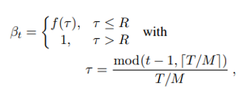

# Make Data

## Distribution

|distribution|equation|implemented|
|:-:|:-:|:-:|
|Gumbel distribution|| ✔️|
|Gaussian distribution|-|❌|
 
    python distributions/gumbel.py

## Type1

* beta_annealing

|Type|equation|implemented|
|:-:|:-:|:-:|
|beta_annealing|| ✔️|
