# Visualize

# General Data Visualization 🐲

일반적인 데이터에 대한 시각화를 모아놓은 레포지터리입니다.

ipynb 파일 형식으로 데이터 시각화에 대한 소스코드를 올려놓았습니다. 

---

## 1. Circular Chart

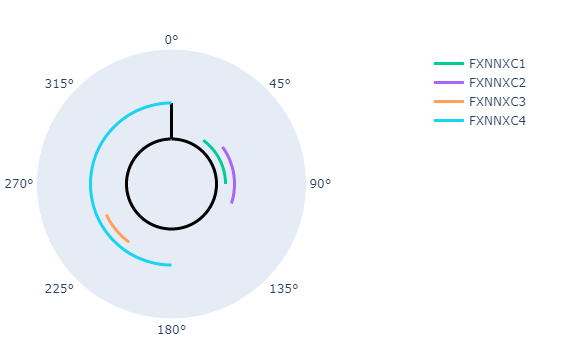

---

## 2. Credit Card Use Amount

* #### 성별 나이에 따른 카드 이용 금액
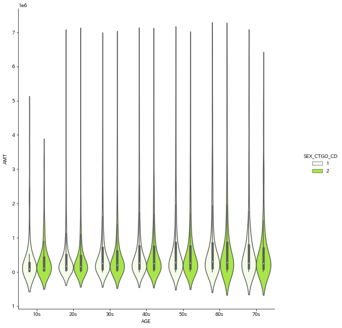

* ####  지역별 카드 이용 금액1
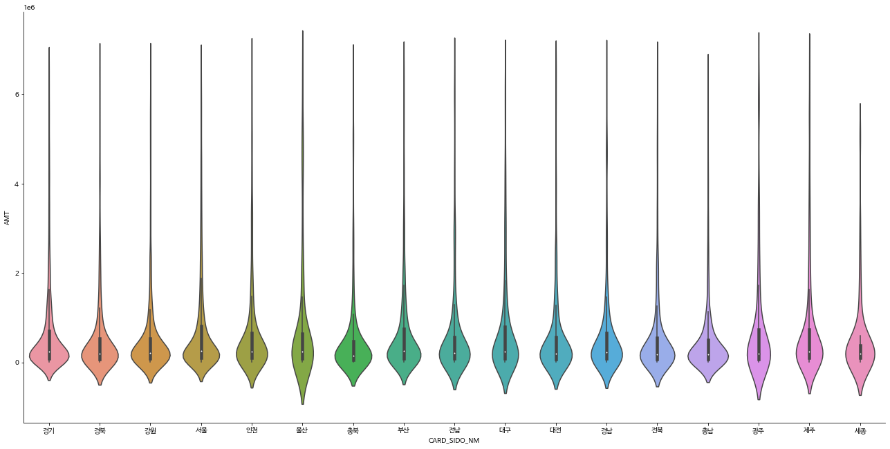

* #### 지역별 카드 이용 금액2
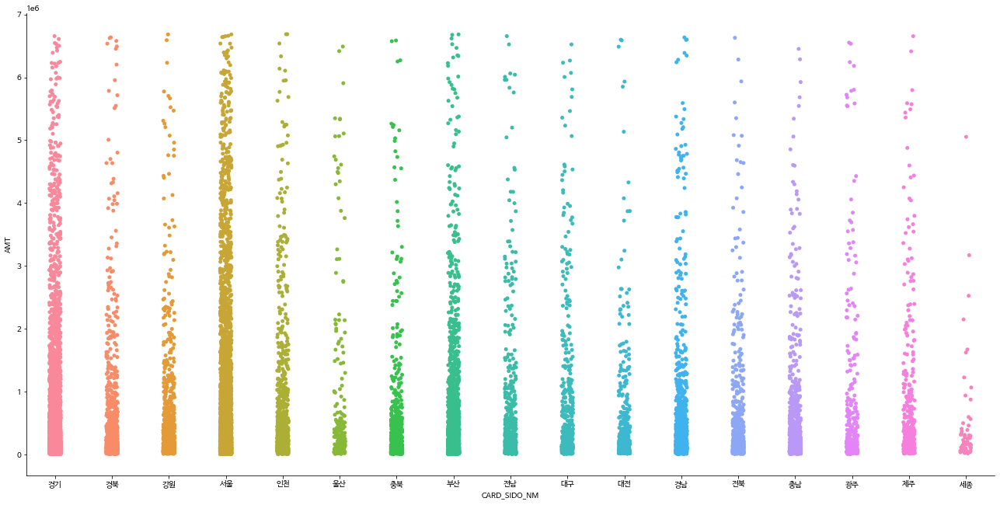

* ####  지역별 년도에 따른 카드 이용 금액
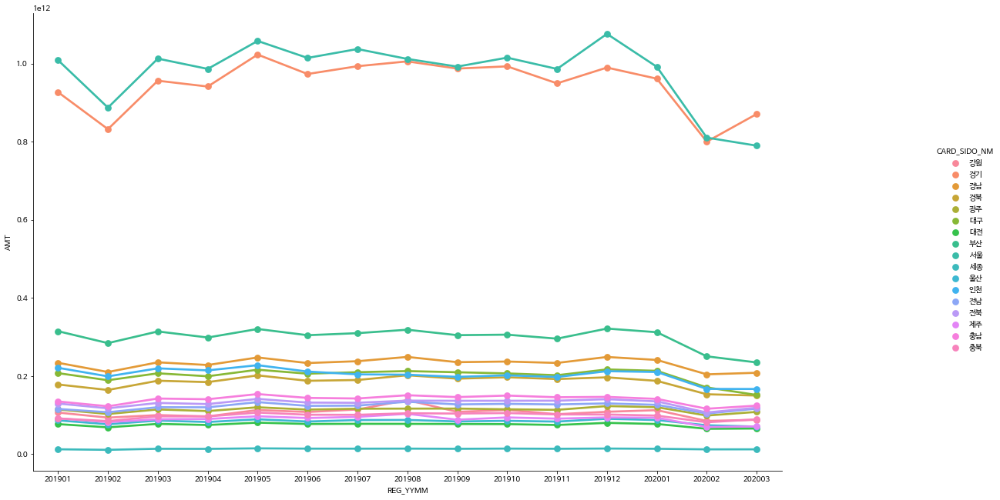

* ####  업종별 전체 카드 이용 금액
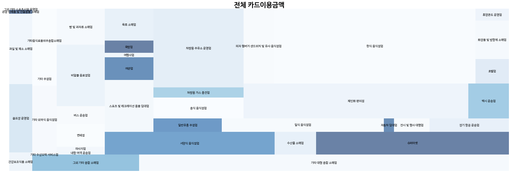

* #### 업종별 년도에 따른 카드 이용 금액 
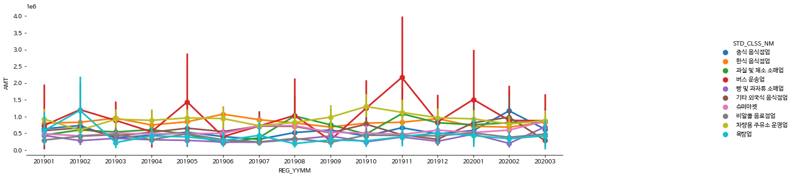

---
## 3. Matplotlib color map

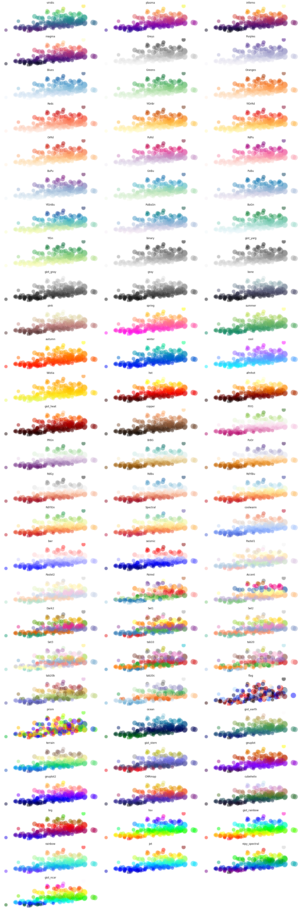

---

추가 예정...💬

# 🔤 NLP_visualization

이 저장소는 자연어 데이터의 시각화 사례들에 대한 연구를 위해서 생성되었습니다. 

자연어 시각화 사례들을 모으고 시각화를 바로 적용할 수 있게 관련 코드를 ipynb 파일 형식으로 모아두었습니다. 

## Useful sites
<kbd>

</kbd>

* wiki data visualization : https://en.wikipedia.org/wiki/Data_visualization
* matplotlib color map : https://matplotlib.org/3.1.0/tutorials/colors/colormaps.html
* matplotlib color  : https://matplotlib.org/3.1.0/gallery/color/named_colors.html
---

## 1. Domain_specific_ranking_using_word2vec_cosine_distance

* 단어에 대하여 가장 유사한 나라를 보여주는 시각화 입니다.
* Word2Vec Embedding을 사용합니다.

<kbd>
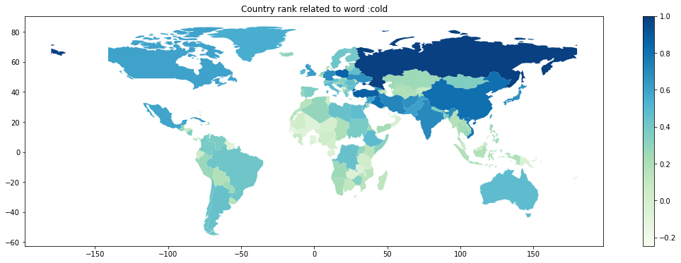
</kbd>

---

## 2. Word Cloud

* 단어 빈도수 기준으로 크기를 정합니다.
* Mask를 이용해서 mask 내부에 단어를 표현할 수 있습니다. 

* By Text

<kbd>
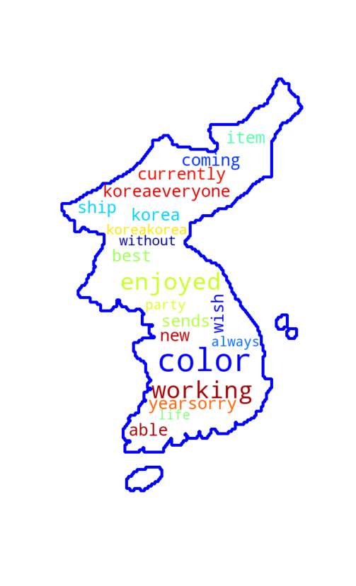
</kbd>

* By Crawling

<kbd>
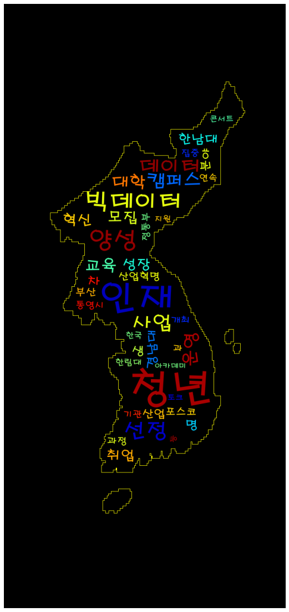
</kbd>

---

## 3. Tree Map

* 단어에 해당하는 Value(값)의 크기에 상자 크기가 비례합니다.

<kbd>
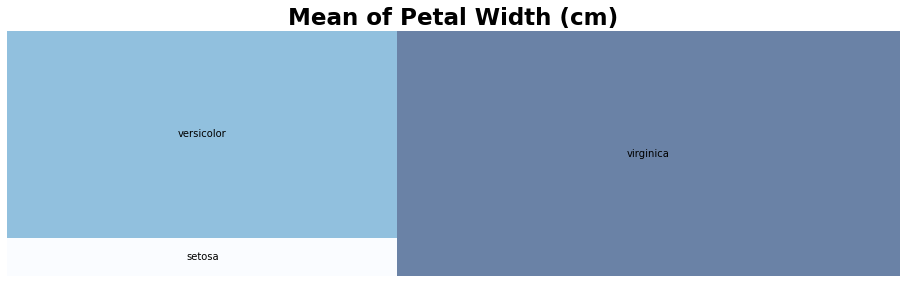
</kbd>

---
## 4. Conversation_Sentiment_by_time

* 시간에 따라서 사용자의 감정 점수를 시각화한 것입니다. 
* Vibration이 심할 수록 감정 기복이 심합니다. 

<kbd>

</kbd>

---
## 5. COVID Policy

단어 빈도수 Top

<kbd>

</kbd>

정책의 감정 Polarity 

<kbd>
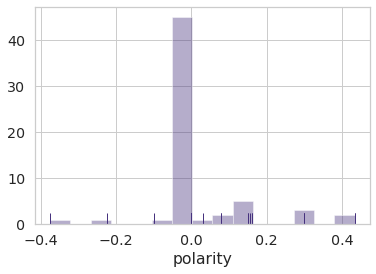
</kbd>

---
## 6. Seq Logo

* 단어 비중에 따른 크기 변화

<kbd>
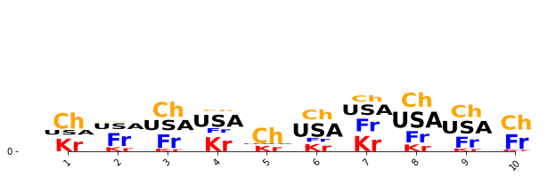
</kbd>

---
## 7. PCA NLP Visualization

* 단어임베딩에 대한 PCA (두 개의 분야에 대하여)

<kbd>
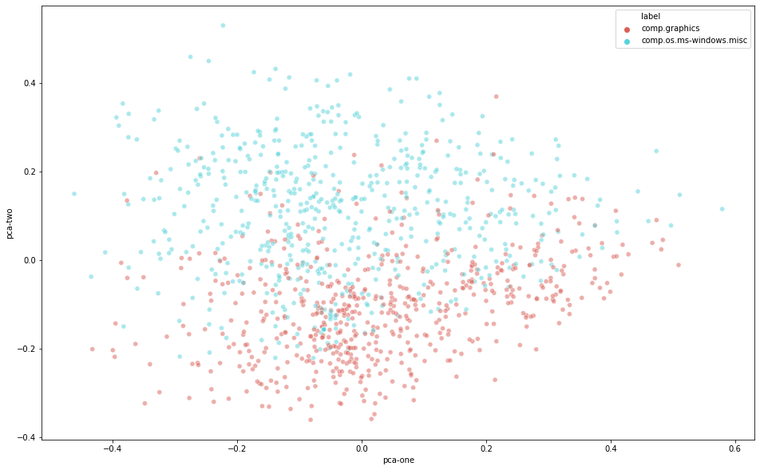
</kbd>

# 🔮 Animation_visualization 

시각화를 하는데 있어서 움직이는 것은 정적인 것보다 더 많은 것을 표현할 수 있습니다. 

데이터에 대한 인사이트를 더욱 얻기 위해서 Animation 관련된 기법을 모아두었습니다. 

---
## Coil

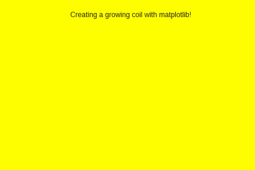
* 점의 누적으로 이미지를 그려줍니다.

---

## Camera
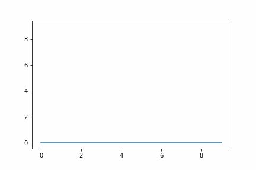
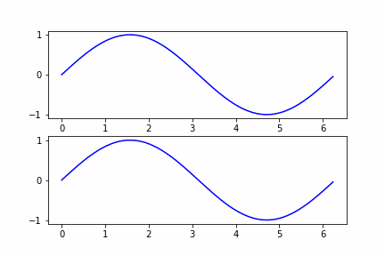
* 매 순간마다 plot 하는 부분을 snap합니다. 
* 중복은 되지 않습니다. 

---

## NLP_COUNT

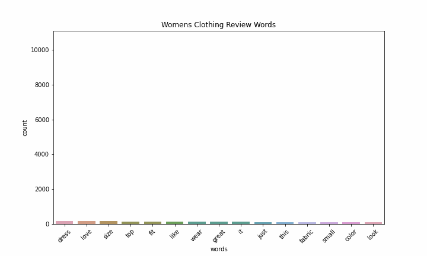

추가 예정...💬

---
추가 예정...💬

